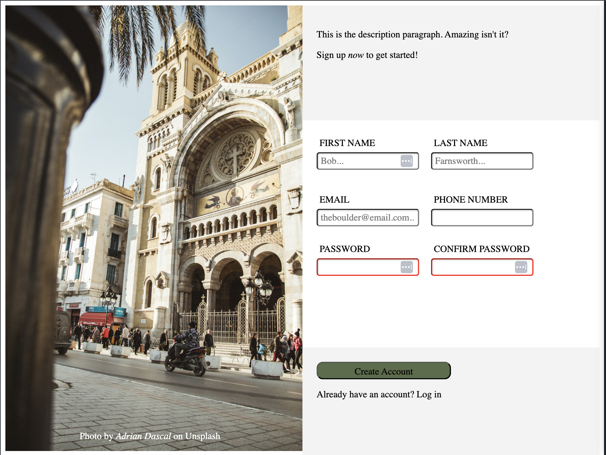

# Sign Up Form Project

This project is a simple and stylish sign-up form built using HTML and CSS. It includes input fields for first name, last name, email, phone number, password, and password confirmation, along with a submission button. The form is designed with a clean and modern layout, featuring an eye-catching hero image.

## Project Overview

The purpose of this project is to practice and demonstrate the ability to create a responsive sign-up form with proper HTML structure, styling, and user interface components. This project is part of [The Odin Project](https://www.theodinproject.com/) curriculum.

## Features

- **Hero Image**: A beautiful background image adds visual appeal to the form.
- **User-Friendly Input Fields**: Clear labels and placeholders for all input fields to guide the user.
- **Basic Form Validation**: Required fields are specified to ensure all necessary information is collected.

## Technologies Used

- **HTML5**: For creating the structure of the form.
- **CSS3**: For styling and layout of the form.

## Screenshot



## Getting Started

To view the form, you can simply open the `index.html` file in any web browser.

1. Clone the repository:
    ```sh
    git clone https://github.com/yourusername/signup-form.git
    ```
2. Navigate to the project directory:
    ```sh
    cd signup-form
    ```
3. Open `index.html` in your preferred web browser.

## Credits

- **Photo Credit**: The hero image was taken by [Adrian Dascal](https://unsplash.com/@adriandasc) and is available on [Unsplash](https://unsplash.com/).
- 
## Acknowledgments

- This project is a part of the curriculum of [The Odin Project](https://www.theodinproject.com/).
